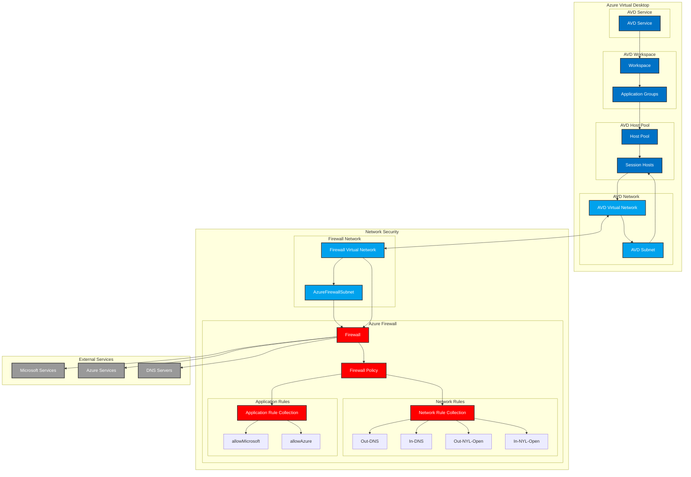

Open this in https://mermaid.live/ to see the diagram.

# Detailed AVD and Firewall Architecture

This diagram shows the detailed architecture of Azure Virtual Desktop (AVD) and Azure Firewall components in our infrastructure.

## Components

### Azure Virtual Desktop
- **Host Pool**: Contains session hosts for user connections
- **Workspace**: Manages application groups and host pool assignments
- **Application Groups**: Groups of applications available to users
- **Session Hosts**: Virtual machines running the AVD service
- **AVD Virtual Network**: Dedicated network for AVD resources
- **AVD Subnet**: Subnet for session hosts

### Network Security
- **Azure Firewall**: Central network security component
- **Firewall Policy**: Defines security rules and configurations
- **Network Rules**:
  - Out-DNS: Allows outbound DNS traffic
  - In-DNS: Allows inbound DNS traffic
  - Out-NYL-Open: Allows outbound traffic to private networks
  - In-NYL-Open: Allows inbound traffic from private networks
- **Application Rules**:
  - allowMicrosoft: Allows traffic to Microsoft services
  - allowAzure: Allows traffic to Azure services
- **Firewall Virtual Network**: Dedicated network for firewall
- **AzureFirewallSubnet**: Dedicated subnet for the firewall

### External Services
- **Microsoft Services**: Required Microsoft endpoints
- **Azure Services**: Required Azure endpoints
- **DNS Servers**: Internal and external DNS servers

## Network Architecture
- AVD resources are deployed in a dedicated virtual network
- Firewall is deployed in a separate virtual network
- VNet peering is configured between AVD and Firewall networks
- All external traffic from AVD goes through the firewall

## Traffic Flow
1. User connects to AVD service
2. AVD service routes to appropriate session host
3. Session host traffic goes through AVD VNet
4. Traffic is routed through VNet peering to Firewall VNet
5. Firewall applies network and application rules
6. Allowed traffic reaches external services
